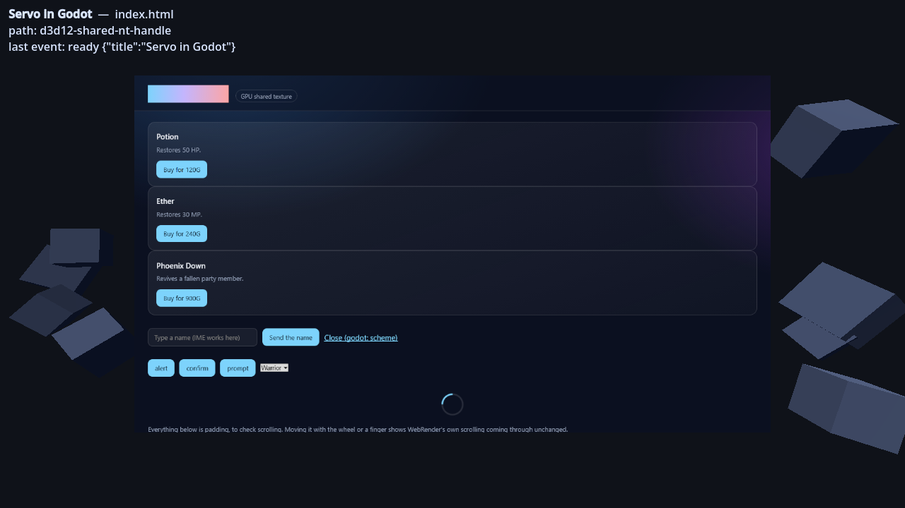
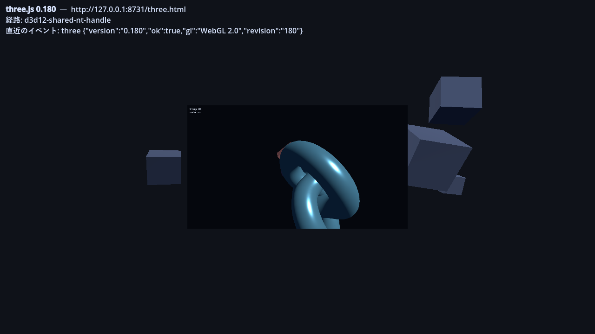

# godot-servo

[English](README.md) | 日本語

Servo (Rust 製ブラウザエンジン) を Godot 4 の GDExtension として組み込み、
描画結果を **GPU テクスチャのまま** Godot に渡す。

Web の UI を in-game のパネルに貼り、クリック・スクロール・キー入力を転送し、
ページ側のボタンなどを Godot のシグナルとして受け取れる。



## 状態

Windows / D3D12 で動作を確認済み。

```
--- godot-servo self check ---
  path: d3d12-shared-nt-handle
  OK   bridge_event (godot.emit)  (expected 'ready')
  OK   evaluate_javascript / script_result  (button at (95.2, 189.4))
  OK   click -> onclick -> bridge_event  (expected 'buy')
  OK   focus input -> ime_requested  (caret [P: (28.0, 509.0), S: (220.0, 36.0)])
  OK   ime composition -> input value  (value '日本語')
  OK   os ime sequence -> committed once  (value '日本')
  OK   wheel -> scroll  (scrollTop 0 -> 608)
--- 0 failed ---
```

| プラットフォーム | 経路 | 状態 |
|---|---|---|
| Windows / D3D12 | ANGLE の D3D11 共有テクスチャ (NT ハンドル) → `ID3D12Resource` | **動作確認済み** |
| macOS / Metal | IOSurface → `MTLTexture` | 実装済み・未実行 |
| Windows / Vulkan (既定) | — | CPU リードバックに落ちる |
| Linux / Vulkan | — | CPU リードバックに落ちる。WSL2 で確認 |
| Android / Compatibility | `AHardwareBuffer` → `EGLImage` → `ExternalTexture` | 実装済み・未実行 |
| Android / Forward+ · Mobile | — | CPU リードバックに落ちる |
| その他 | `glReadPixels` → `ImageTexture` | 動作確認済み |

GPU 共有が使えない環境では自動的に CPU リードバックへ落ちる。
「対応レンダラでないと起動しない拡張」にはならない。
実際にどちらが使われたかは `ServoWebView.get_backend_name()` で分かる。

Vulkan で GPU 共有を効かせるには Godot 側に
[godotengine/godot#114940](https://github.com/godotengine/godot/pull/114940)
が要る。`VK_KHR_external_memory_win32` (Windows) や
`VK_EXT_external_memory_dma_buf` (Linux) をプロジェクト設定から有効化できるようになる PR。

必要な Godot は **4.4 以降**。`RenderingDevice.texture_create_from_extension()` と
`get_driver_resource()` が GDExtension に露出したのが 4.4。

## 構成

リポジトリのルートがそのまま Godot プロジェクトになっている。クローンして
Godot で開けば動く。

```
godot_servo.gdextension          拡張の宣言。プロジェクト直下に置く
addons/godot_servo/bin/          ビルド成果物 (commit しない)
  windows/godot_servo.x86_64.dll
  windows/libEGL.dll             ANGLE。拡張と同じフォルダに要る
  windows/libGLESv2.dll
demo/                            デモのシーンとページ
project.godot
scripts/build.ps1 | build.sh     ビルドして bin/ へ配る
src/                             GDExtension 本体 (Rust)
```

配布物 (リリースの zip) は `godot_servo.gdextension` と `addons/godot_servo/` の
2 つだけ。使う側のプロジェクトにそのまま置ける。

## ビルド

```sh
scripts/build.ps1                 # Windows。ビルドして bin/ へ配置 (debug)
scripts/build.ps1 -Release
./scripts/build.sh                # Linux / macOS
./scripts/build.sh --release
./scripts/build.sh --android      # Android arm64-v8a。cargo-ndk が要る
```

Android は Linux か macOS からクロスビルドする必要がある。jemalloc の `configure` が
Windows のビルドホストを受け付けない (`Invalid configuration 'x86_64-pc-win32'`) ため、
`build.ps1` に Android の経路は無い。

スクリプトは `INPUT(-lunwind)` だけを書いた `libgcc.a` のスタブを `target/` に置き、
リンクの探索パスに足している。NDK r23 で libgcc が廃されて libunwind に移ったが、
依存のどれかがまだリンカに `-lgcc` を要求するため。

mozangle がビルドした `libEGL.dll` / `libGLESv2.dll` も、ビルドスクリプトが
mozangle の `OUT_DIR` から拾って配る。surfman が実行時に名前で `LoadLibrary` するので、
この 2 つは拡張の DLL と同じフォルダに要る (`src/angle_loader.rs` が絶対パスで先読みする)。

素の `cargo build` は何も配置しない。ビルドスクリプト経由で使うこと。

## デモ

```sh
export GODOT=~/.local/godot/4.7.2-stable/Godot_v4.7.2-stable_win64_console.exe

scripts/build.ps1 -Run                 # 3D の in-game ブラウザ
scripts/build.ps1 -Run -Scene flat     # 2D の確認用
scripts/build.ps1 -Test                # 入力とシグナルのセルフチェック
```

`project.godot` は Windows のレンダラを `d3d12` にしている。既定の `vulkan` の
ままでも動くが、その場合は CPU リードバック経路になる。

拡張自体は Godot 4.4 以降で動くが、`project.godot` の宣言は `4.7` になっている。
Godot はプロジェクトを開くたびに `config/features` を自分のバージョンへ書き換えるため。
4.4 〜 4.6 ではデモにバージョン警告が出るが、アドオン側には影響しない。

## 使い方

```gdscript
var browser := ServoWebView.new()
browser.view_size = Vector2i(1280, 720)
browser.url = "https://example.com"
add_child(browser)

browser.frame_updated.connect(func() -> void:
    material.albedo_texture = browser.get_texture()
    if browser.is_texture_flipped_v():
        # macOS の IOSurface 経路だけ上下が逆に届く。
        material.uv1_scale = Vector3(1.0, -1.0, 1.0)
        material.uv1_offset = Vector3(0.0, 1.0, 0.0)
)

# 入力の転送。position は WebView 内のピクセル座標。
browser.feed_input(event, local_position)

# ページからの通知。
browser.bridge_event.connect(func(name: String, payload: String) -> void:
    print(name, " ", payload)
)
```

### ページ側から Godot にイベントを飛ばす

拡張が `window.godot` を注入する。

```js
godot.emit("buy", { item: "potion", price: 120 });   // payload は JSON 文字列で届く
```

JavaScript を書かずに、素のリンクでも飛ばせる。

```html
<a href="godot:buy?item=potion">買う</a>              <!-- payload はクエリ文字列 -->
```

前者は目印つきの `console.log` を `show_console_message` で拾っている。
ナビゲーションを起こさないのでページの状態に影響しない。
後者は `godot:` スキームへの遷移を `request_navigation` で横取りして `deny()` している。

### 日本語入力 (IME)

ページ内の編集可能な要素にフォーカスが入ると Servo が拡張に通知し、拡張が OS の IME を
起こして `ime_requested(caret, multiline)` を出す。`caret` は WebView 内のピクセル座標。

変換候補のウィンドウは OS がウィンドウ座標で出すため、3D の板が画面のどこにあるかは
拡張からは分からない。キャレットを自分で射影して `ime_anchor` に入れる。

```gdscript
browser.ime_requested.connect(func(caret: Rect2, _multiline: bool) -> void:
    var bottom_left := Vector2(caret.position.x, caret.position.y + caret.size.y)
    browser.ime_anchor = camera.unproject_position(view_pixels_to_world(bottom_left))
)
```

デモの 2 つのシーンはどちらもこれをやっている。やらないと候補がウィンドウ左上に出る。

OS の IME ではなく独自の入力 UI から変換を流し込む場合は
`feed_ime_composition(state, text)` を使う。`state` は `"start"` / `"update"` / `"end"` で、
`"end"` に渡した文字列が確定する。`feed_ime_preedit(text)` は OS の IME と同じ経路をたどる。
未確定文字列を渡し、次に空文字列を渡し、確定文字を `feed_input()` で送る。

**既知の制限**: 変換を取り消すと未確定文字列が入力欄に残る。Servo の
`compositionend` は data が空のとき選択を外すだけで文字を消さず、composition API に
未確定文字列を削除する手段が無いため、送るものが無い。

### API

| | |
|---|---|
| `url`, `view_size`, `autostart` | エクスポートされたプロパティ |
| `start()` / `stop()` / `is_running()` | 生存管理 |
| `get_texture()` / `is_texture_flipped_v()` / `get_backend_name()` | 表示 |
| `load_url()` / `reload()` / `go_back()` / `go_forward()` | ナビゲーション |
| `evaluate_javascript(code) -> int` | 結果は `script_result(id, value)` で返る |
| `feed_input(event, position)` / `notify_pointer_left()` | 入力 |
| `feed_ime_composition(state, text)` / `cancel_ime_composition()` / `ime_anchor` | IME |
| `set_view_size_px(size)` | 解像度変更 |

シグナル: `frame_updated`, `title_changed`, `url_changed`, `load_started`,
`load_finished`, `cursor_changed`, `console_message`, `bridge_event`, `script_result`,
`ime_requested`, `ime_dismissed`

## WebGL / WebGPU

Servo は WebGL / WebGPU の描画結果も同じ共有テクスチャに乗せてくる。
`demo/web/` に確認用ページを置いてある。

| | 結果 |
|---|---|
| WebGL 1.0 | 動く |
| WebGL 2.0 | 動く (`enable_webgl2` が必要) |
| three.js r128 | 動く |
| three.js 0.180 (最新) | 動く (WebGL 2.0 経由) |
| WebGPU | **ビルドに含めていない。落ちるため** |



WebGL2 と WebGPU はどちらも Servo 側の既定が無効なので、`ServoWebView` の
`enable_webgl2` / `enable_webgpu` から `dom_webgl2_enabled` /
`dom_webgpu_enabled` を立てている。

```sh
scripts/build.ps1 -Run -Page webgl          # 素の WebGL
scripts/build.ps1 -Run -Page three-legacy   # three.js r128

# ES モジュールを使うページはローカルサーバ経由で開く。
( cd demo/web && python -m http.server 8731 --bind 127.0.0.1 & )
scripts/build.ps1 -Run -Page http://127.0.0.1:8731/three.html
```

`-Page` は `res://demo/web/<name>.html` を開く。`http` で始まる文字列を渡すとそのまま
URL として扱う。

### WebGPU の状態

`webgpu` feature は**入れていない**ので、既定のビルドに `navigator.gpu` は無い。
有効にすると wgpu と naga がまるごとバイナリに乗るうえ、落ちるものを同梱することになる。

feature を有効にしてビルドし、`enable_webgpu` を立てると `navigator.gpu` は生えて、`requestAdapter()` / `requestDevice()` /
コンピュートシェーダの実行と読み戻しまでは正しく動く
(`demo/web/webgpu-compute.html` が `[0, 20, 126]` を返す)。

ただし **プロセスが segfault で落ちる**。canvas に提示しようとすると確実に、
コンピュートのみでも終了時に落ちた。原因は未調査。既定は無効にしてある。

`file://` から開いた場合は `requestAdapter()` が解決しないまま止まる。
`http://127.0.0.1` からなら先へ進む。

### webgpu feature を有効にするときの注意

そのままでは `wgpu-hal` のビルドが落ちる。`ipc-channel` が `windows ^0.61` を
要求するため `gpu-allocator` (`windows >=0.53, <=0.62`) が 0.61 に引きずられ、
`windows 0.62` を要求する `wgpu-hal` と型が合わなくなる。

```sh
cargo update -p gpu-allocator   # gpu-allocator の windows を 0.62 に寄せる
```

## 設計メモ

### 単一バッファ

surfman のオフスクリーンサーフェスを 1 枚だけ確保して固定し、スワップチェーンを
使わない。Godot に渡すテクスチャの RID が生存期間中ずっと変わらずに済む。
代償として Servo の描画中に Godot がサンプルしうるが、`paint()` → blit → `glFlush`
→ Godot の描画 の順序をメインスレッドで守っているため実害は出ていない。

### 同期

Godot の `RenderingDevice` には外部セマフォを submit に差し込む API がない
(`submit()` / `sync()` はローカルデバイス専用)。そのため `glFlush` に頼っている。
これは wgpu 向けの同種の実装 (`wgpu-native-texture-interop`) でも同じで、
明示的セマフォは "not yet handled by any built-in synchronizer" とされている。

### D3D12 で 1 回コピーしている理由

Godot の D3D12 ドライバの `_texture_create_shared_from_slice()` は、アロケーションを
持つテクスチャしか受け付けない。外部から取り込んだテクスチャは弾かれる。
`Texture2DRD` は内部で `texture_create_shared()` を呼ぶため、取り込んだテクスチャを
直接渡すと**白く抜ける**。

Vulkan ドライバは同じ判定に `|| created_from_extension` の例外を持っているので、
これは D3D12 ドライバ側の穴。

回避策として、取り込んだテクスチャから Godot 所有のテクスチャへ
`RenderingDevice.texture_copy()` で複製している。GPU 上で完結するので CPU 往復は
発生しない。macOS の Metal ドライバにはこの制限がないため、そちらは直接渡している。

## 未実装

- **Scene Color の逆流** (CSS `backdrop-filter` でゲーム画面をぼかす)。
  Godot 側は `CompositorEffect` で足りるが、受け取る Servo 側に
  `WebRenderImageHandlerType` を足す fork が要る。
- **WebGPU**。上記のとおりプロセスが落ちる。
- 複数 `ServoWebView` の同時利用。`Servo` 本体は共有する作りにしてあるが未検証。
- macOS と Android の実機確認。CI でビルドは通るが、誰も動かしていない。
- iOS。surfman にも Servo にも対応が無く、JIT と `dlopen` も使えない。
- Linux の GPU 共有経路。動きはするが CPU リードバック。

## 関連プロジェクト

Servo を Godot に組み込むアドオンは他に 2 つある。どちらも `SoftwareRenderingContext` と
`read_to_image()` で描画していて、これは GPU 共有が使えないときにこのプロジェクトが落ちる
CPU リードバックと同じ経路にあたる。

| | 描画 | ライセンス |
|---|---|---|
| [Decapitated/Godot-Servo](https://github.com/Decapitated/Godot-Servo) | CPU リードバック | LGPL-3.0 |
| [emanuelbertey/web-servo-godot](https://github.com/emanuelbertey/web-servo-godot) | CPU リードバック | 表記なし |
| これ | GPU 共有テクスチャ、不可なら CPU | MIT / Apache-2.0 |

GPU 経路が要らないなら、現時点では `web-servo-godot` のほうが守備範囲が広い。シグナルが多く、
JavaScript の API があり、Linux と Android が動いている。ただしライセンス表記が無いので、
既定では全権利留保である点に注意。

## ライセンス

[Apache License 2.0](LICENSE-APACHE) と [MIT ライセンス](LICENSE-MIT) のデュアル。
どちらを選んでもよい。

Servo 自体は MPL-2.0 だが、この crate は改変せずに依存しているだけなので、
ファイル単位のコピーレフトは利用側のコードには及ばない。`demo/web/vendor/` に
置いている three.js のビルドは MIT で、元のライセンスヘッダをそのまま保持している。
