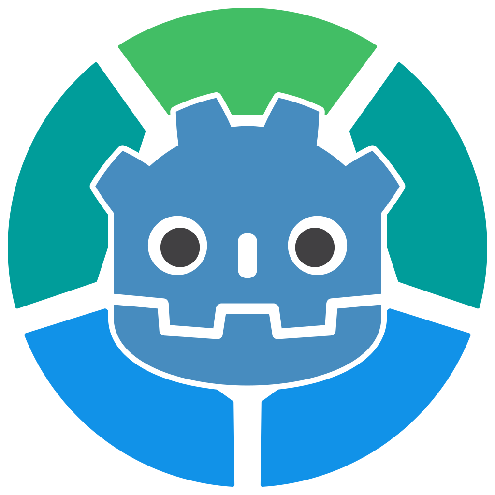

<p align="center">
  
</p>

<h1 align="center">godot-servo</h1>

<p align="center">
  <a href="README.md">English</a> | 日本語
</p>

`godot-servo` は Rust 製のブラウザエンジン [Servo](https://servo.org/) を GDExtension として
Godot 4 に組み込み、描画結果を **GPU テクスチャのまま** Godot に渡すアドオンです。

ゲーム内のパネルに Web の UI を貼り、ポインタ・タッチ・キーボードの入力をそのまま転送し、
ページ側のボタン操作を Godot のシグナルで受け取れます。


## できること

- **CPU を経由しない。** Servo がオフスクリーンの GPU サーフェスに描き、Godot がそれを直接サンプリングします。
- **本物の Web レンダリング。** HTML、CSS、JavaScript、WebGL 1 / 2、three.js (最新版を含む)。
- **オーバーレイではなく、ゲームの中。** 結果は `Texture2D` なので、3D パネルにもマテリアルにも `TextureRect` にも貼れます。
- **マウス・タッチ・キーボード入力**。日本語などの IME 変換にも対応します。
- **双方向のやり取り。** 入力をページへ転送し、ページのイベントをシグナルで受け取ります。
- **必ず起動するフォールバック。** GPU 共有が使えない環境では、起動を諦めずに CPU リードバックへ切り替えます。

## 対応プラットフォーム

各プラットフォームで、そのグラフィックススタックが用意している仕組みを使って GPU メモリを共有します。
共有経路が無い組み合わせでは `glReadPixels` によるリードバックに落とします。1 フレームあたりの往復は増えますが、
どこでも動きます。

| プラットフォーム | 経路 | 実機での状態 |
| --- | --- | --- |
| Windows / D3D12 | ANGLE の D3D11 共有テクスチャ (NT ハンドル) → `ID3D12Resource` | 確認済み |
| Windows / Vulkan | ANGLE の D3D11 共有テクスチャ (NT ハンドル) → `VkImage` | 確認済み |
| Android / Compatibility | `AHardwareBuffer` → `EGLImage` → `ExternalTexture` | 確認済み |
| macOS / Metal | IOSurface → `MTLTexture` | 確認済み |
| Linux / Vulkan | `VkImage` → opaque fd → `GL_EXT_memory_object` | llvmpipe で確認 |
| Android / Forward+ · Mobile | `VkImage` → opaque fd → `GL_EXT_memory_object` | 確認済み |
| macOS / Vulkan (MoltenVK) | IOSurface → `VkImage` | 確認済み |

実際にどの経路を通ったかは `ServoWebView.get_backend_name()` で分かります。

### プロジェクト設定が要るのは Windows と macOS

Vulkan のデバイス拡張はデバイス生成時に決まります。GDExtension が読み込まれるよりずっと前です。
Godot が要求しない拡張が共有に必要なら、要求できるのはプロジェクトだけで、それには
[godotengine/godot#114940](https://github.com/godotengine/godot/pull/114940) が要ります。この PR は
`rendering/rendering_device/vulkan/additional_device_extensions` というプロジェクト設定と、
実際に有効になった拡張を読み出す `RenderingDevice.get_device_enabled_extensions()` を追加します。

```ini
[rendering]

rendering_device/vulkan/additional_device_extensions=PackedStringArray("VK_KHR_external_memory_win32", "VK_EXT_metal_objects")
```

| プラットフォーム | デバイス拡張 | 素の Godot では |
| --- | --- | --- |
| Windows | `VK_KHR_external_memory_win32` | 無効。設定が要る |
| macOS (MoltenVK) | `VK_EXT_metal_objects` | 無効。設定が要る |
| Linux・Android | `VK_KHR_external_memory_fd` | **既定で有効** |

Linux と Android がこの表の良い側にいるのは、共有の仕組みを選んだ結果です。opaque fd は、Godot が
何も言われずに拡張を有効化してくれる唯一の外部メモリハンドルです。Godot は
`VK_KHR_external_memory_fd` をこれとは無関係の理由で登録しています。一部プラットフォームの
ランタイムが検証レイヤーを騒がせるのを抑えるためです。おかげでこの 2 つは、パッチも設定も無い
Godot で GPU メモリを共有できます。dma-buf や `AHardwareBuffer` の経路なら、どちらも Godot が
決して登録しない拡張を要求することになっていました。

設定が要る経路だけが、起動時にメソッドの有無を調べます。無ければ Vulkan レンダラは CPU
リードバックに落ち、理由をログに出します。起動には失敗しません。あれば、有効になっている拡張を
見て決めます。そのうえでどの経路もデバイス自身に確認します。拡張が一覧に載っていてもエントリ
ポイントが解決しないことはあり、一覧上の名前は主張に過ぎず、解決した関数だけが事実だからです。

### レンダラの設定

- **Windows** の既定は Vulkan で、そちらにも共有テクスチャの経路ができました。
  `rendering/rendering_device/driver.windows` を `d3d12` にする手もまだ有効で、こちらは Godot に
  4.4 以上であること以外を求めません。このプロジェクトがその値を残しているのはそのためです。
- **Android** は 3 つのレンダラすべてで動きますが、経路は 2 種類です。Compatibility (GLES3) は
  `AHardwareBuffer` を共有し、`ExternalTexture` として受け取るので、シェーダに
  `samplerExternalOES` が要ります (`needs_external_sampler()` 参照)。Forward+ と Mobile は代わりに
  `VkImage` を fd 経由で共有し、ふつうの `sampler2D` テクスチャとして届きます。`ExternalTexture`
  の経路が Compatibility 限定なのは、RenderingDevice 側のバックエンドで
  `texture_external_initialize()` が空実装だからです。
- **macOS** の既定は Metal で、そちらはプロジェクト設定を必要としません。Vulkan の経路は
  MoltenVK で動かしている場合のためのものです。

## 必要なもの

- **Godot 4.4 以降。** `RenderingDevice.texture_create_from_extension()` と
  `get_driver_resource()` が GDExtension に出たのが 4.4 です。
- ソースからビルドするなら **Rust 1.94 以降**。
- Android 向けには **cargo-ndk** と NDK、そして Linux か macOS のホスト。

## リポジトリの構成

リポジトリのルートがそのまま Godot プロジェクトです。クローンして Godot で開けば動きます。

```
godot_servo.gdextension          拡張のマニフェスト。プロジェクト直下に置く
addons/godot_servo/
  servo_texture_rect.gd          TextureRect にページを載せて操作を通す
  servo_panel_3d.gd              同じことを 3D の QuadMesh パネルで
  local_pages.gd                 res:// のページを開ける file:// URL にする
  select_picker.gd               ページの <select> に答える PopupMenu
  cursors.gd                     CSS のカーソル名を Godot のカーソル形状へ
  servo_external.gdshader        Android GLES3 経路用の samplerExternalOES
  servo_external_canvas.gdshader 同じものの Control 版
  bin/                           ビルド成果物の置き場 (コミットしない)
    windows/godot_servo.x86_64.dll
    windows/libEGL.dll           ANGLE。実行時に名前で読まれる
    windows/libGLESv2.dll
    android/arm64-v8a/libgodot_servo.so
demo/                            デモのシーンとページ
project.godot
scripts/build.ps1 | build.sh     ビルドして bin/ へ配置する
src/                             拡張本体 (Rust)
```

リリースのアーカイブには `addons/godot_servo/` が一式入っています (`bin/` が埋まり、
`godot_servo.gdextension` もその中にあります)。このフォルダを自分のプロジェクトに重ねれば使えます。
このリポジトリでマニフェストがルートにあるのは、リポジトリのルートがそのままデモの
プロジェクトだからです。ファイル内の `res://` パスは絶対なので、どちらに置いても同じに解決します。
置くのは 1 か所だけにしてください。2 つあると同じ拡張が二重に登録されます。

## ビルド

```sh
scripts/build.ps1                 # Windows: ビルドして配置 (debug)
scripts/build.ps1 -Release
./scripts/build.sh                # Linux / macOS
./scripts/build.sh --release
./scripts/build.sh --android      # Android arm64-v8a。cargo-ndk が要る
```

`cargo build` だけでは配置まで行いません。ビルドスクリプトを使ってください。
ライブラリを `addons/godot_servo/bin/` へコピーするほか、mozangle が生成した `libEGL.dll` と
`libGLESv2.dll` を、ビルド完了後にそのクレートの `OUT_DIR` から拾って配置します。
surfman は ANGLE を実行時にファイル名で読むので、この 2 つは拡張の DLL と同じ場所に要ります
(`src/angle_loader.rs` が絶対パスで先読みします)。

### Android

Linux か macOS (WSL を含む) からクロスコンパイルします。Windows ホストではビルドできません。
Servo の C 依存 2 つを同時に満たすホストツールチェーンが無いためです。jemalloc の `configure` は
MSVC のホストトリプルを受け付けず、glsl-optimizer は mingw でコンパイルが通りません。

`ANDROID_NDK_HOME` を NDK に向けてから実行します。

```sh
export ANDROID_NDK_HOME=~/android/android-ndk-r27c
./scripts/build.sh --release --android
```

スクリプトは `INPUT(-lunwind)` だけを書いた `libgcc.a` のスタブを `target/` に置き、
リンクの探索パスに足します。NDK r23 で libgcc が libunwind に置き換わったのに、
依存のどれかがまだリンカに `-lgcc` を要求するためです。

## デモを動かす

```sh
export GODOT=~/.local/godot/4.7.2-stable/Godot_v4.7.2-stable_win64_console.exe

scripts/build.ps1 -Run                 # 3D の in-game ブラウザ
scripts/build.ps1 -Run -Scene flat     # 2D。切り分け用
scripts/build.ps1 -Test                # 入力とシグナルのセルフチェック
```

セルフチェックは拡張を端から端まで動かして、何を確かめたかを出力します。

```
--- godot-servo self check ---
  path: d3d12-shared-nt-handle
  OK   [  0.2s] bridge_event (godot.emit)  (expected 'ready')
  OK   [  0.5s] evaluate_javascript / script_result  (button at (96.2, 189.4))
  OK   [  0.6s] click -> onclick -> bridge_event  (expected 'buy')
  OK   [  0.7s] touch tap -> onclick -> bridge_event  (expected 'buy')
  OK   [  2.5s] touch drag -> scroll  (scrollTop 0 -> 476)
  OK   [  2.9s] focus input -> ime_requested  (caret [P: (28.0, 509.0), S: (220.0, 36.0)])
  OK   [  3.4s] ime composition -> input value  (value '日本語')
  OK   [  4.0s] os ime sequence -> committed once  (value '日本')
  OK   [  4.1s] alert -> dialog_alert  (message 'hello from the page')
  OK   [  4.4s] respond_to_dialog releases the page  (no pending)
  OK   [  4.9s] confirm -> respond_to_dialog(true)  (value true)
  OK   [  5.0s] prompt -> dialog_prompt  (default 'hero')
  OK   [  5.5s] prompt -> respond_to_dialog(text)  (value 'godot')
  OK   [  5.6s] select -> select_element_requested  (4 options, last group 'Advanced')
  OK   [  6.1s] respond_to_select sets the value  (value 'sage')
  OK   [  7.3s] wheel -> scroll  (scrollTop 0 -> 608)
--- 0 failed ---
```

### APK を作る

```sh
./scripts/build.sh --release --android

godot --headless --path . --export-debug Android godot-servo.apk
adb install -r godot-servo.apk
```

release ビルドは `[profile.release]` の `strip = true` で strip されます。arm64-v8a のライブラリは
119 MB、APK にして 146 MB です。debug ビルドは 1474 MB あり APK に載る大きさではないので、
Android は release でしかビルドしません。大半は SpiderMonkey、Stylo、WebRender、
そして ICU のデータです。

## 使いかた

いちばん短い道はアドオンのコンポーネントです。`TextureRect` に `servo_texture_rect.gd` を、
または `QuadMesh` と `CollisionObject3D` の子を持つ `MeshInstance3D` に `servo_panel_3d.gd` を
アタッチし、スクリプトの `browser` を WebView ノードに向けてください。テクスチャ、座標変換、
入力の転送、カーソル、IME アンカーはこの 2 つが引き受けます。つまり以下のうち、URL と
ページからの返答以外はすべて不要になります。実例は `demo/main.tscn` と `demo/flat.tscn` です。

以降は、そのコンポーネントが中で何をしているかの説明です。自分で書きたい場合に読んでください。

```gdscript
var browser := ServoWebView.new()
browser.view_size = Vector2i(1280, 720)
browser.url = "https://example.com"
add_child(browser)

browser.frame_updated.connect(func() -> void:
    material.albedo_texture = browser.get_texture()
    if browser.is_texture_flipped_v():
        material.uv1_scale = Vector3(1.0, -1.0, 1.0)
        material.uv1_offset = Vector3(0.0, 1.0, 0.0)
)

# 入力を転送する。position は WebView 内のピクセル座標。
browser.feed_input(event, local_position)

# ページからのイベントを受け取る。
browser.bridge_event.connect(func(name: String, payload: String) -> void:
    print(name, " ", payload)
)
```

テクスチャの扱いで 2 つだけプラットフォーム依存の分岐があります。デモのシーンはどちらも対応しています。

- `is_texture_flipped_v()` は macOS の IOSurface 経路で true になります。この経路には
  GL の左下原点を直す転送段が無いので、マテリアル側で上下を戻してください。
- `needs_external_sampler()` は Android で true になります。共有バッファが
  `GL_TEXTURE_EXTERNAL_OES` のテクスチャとして届くためです。`sampler2D` では黒くしか読めないので、
  `samplerExternalOES` を宣言したシェーダをマテリアルに使います。最小限のものを
  `addons/godot_servo/servo_external.gdshader` としてアドオンに同梱しています。

### 入力を転送する

`feed_input(event, position)` はマウス・タッチ・キーボードのイベントを受け取ります。
`position` は WebView 内のピクセル座標なので、先に変換してください。

- `TextureRect` なら、コントロールの位置を引いて `view_size / rect.size` を掛けます。
- 3D パネルなら、`CollisionObject3D.input_event` の当たり位置を UV に直して `view_size` を掛けます。
  `demo/main.gd` に往復の変換があります。

マウスとタッチは両方まとめて流して構いません。Godot は
`input_devices/pointing/emulate_mouse_from_touch` (既定で有効) によってタッチから疑似マウスイベントも
作りますが、`feed_input()` は `device` が `DEVICE_ID_EMULATION` のイベントを落とすので、
1 回の操作が二重に届くことはありません。`emulate_touch_from_mouse` の逆向きも同じ規則で除かれます。

タッチは Servo に本物のタッチイベントとして渡ります。ページには `touchstart` / `touchmove` /
`touchend` が届き、スクロールと慣性は Servo 側のタッチハンドラが処理します。

### 日本語などを IME で入力する

ページ内の編集可能な要素にフォーカスが入ると Servo が拡張に通知し、拡張は OS の IME を有効にして
`ime_requested(caret, multiline)` を出します。`caret` は WebView 内のピクセル座標の矩形です。

変換候補のウィンドウは OS がウィンドウ座標で出すので、3D パネルが画面のどこに映っているかを
拡張は知りません。キャレットを自分で射影して `ime_anchor` に入れてください。

```gdscript
browser.ime_requested.connect(func(caret: Rect2, _multiline: bool) -> void:
    var bottom_left := Vector2(caret.position.x, caret.position.y + caret.size.y)
    browser.ime_anchor = camera.unproject_position(view_pixels_to_world(bottom_left))
)
```

デモのシーンはどちらもこれをやっています。設定しないと候補がウィンドウの左上に出ます。

OS の IME ではなくゲーム側の入力 UI から変換を駆動したい場合は、
`feed_ime_composition(state, text)` を `"start"` / `"update"` / `"end"` で呼びます。
`"end"` に渡した文字列が確定分になります。`feed_ime_preedit(text)` は OS の IME と同じ経路で、
未確定文字列 → 空文字列 の順に渡し、確定した文字は `feed_input()` でキーイベントとして送ります。

**既知の制限。** 変換を取り消すと未確定文字列が欄に残ります。Servo の `compositionend` は
データが空のときに選択を外すだけで、未確定文字列を消す手段が composition の API に無いためです。

### ページのダイアログやピッカーに返事をする

`alert()` / `confirm()` / `prompt()` / `<select>` は、埋め込み側が返事をするまで
ページの JavaScript を止めます。拡張自身は UI を持たないので、それぞれをシグナルで
渡し、ゲーム側で好きな形に見せて返事をしてもらいます。`<select>` も同じで、Servo は
ドロップダウンを描かずに選択肢の一覧を渡してきます。そのためゲーム側でメニューを出すまで、
`<select>` をクリックしても何も起きていないように見えます。その役をする小さな `PopupMenu` を
`addons/godot_servo/select_picker.gd` としてアドオンに同梱しています。

```gdscript
browser.dialog_confirm.connect(func(message: String) -> void:
    var accepted: bool = await my_dialog.ask(message)
    browser.respond_to_dialog(accepted, "")
)

browser.select_element_requested.connect(func(options: Array, multiple: bool) -> void:
    # options は [{ id, label, disabled, group }, ...]。<optgroup> は畳んである。
    var chosen: int = await my_menu.pick(options)
    browser.respond_to_select([chosen])
)
```

必ず返事をしてください。誰も返事をしないダイアログを待つページは、そのまま止まり続けます。
ゲーム側の UI が何も選ばずに閉じたときは `cancel_pending_dialog()` を呼んでください。
`has_pending_dialog()` で返事待ちがあるか分かります。文字列はページが決めるものなので、
ゲーム自身の UI と見分けが付く形で出してください。

ファイル選択・色選択・コンテキストメニューはシグナルにしていません。Servo には既定の返事
(何も選ばない) が返り、ページはそのまま進みます。

### ページから Godot へイベントを送る

拡張はすべてのページに `window.godot` を注入します。

```js
godot.emit("buy", { item: "potion", price: 120 });   // payload は JSON 文字列で届く
```

JavaScript を書かず、ただのリンクでも送れます。

```html
<a href="godot:buy?item=potion">購入</a>              <!-- payload はクエリ文字列 -->
```

前者は目印を付けた `console.log` を `show_console_message` で拾っています。
遷移を起こさないので、ページの状態に触りません。後者は `godot:` スキームへの遷移を
`request_navigation` で捕まえて拒否しています。

### API

| | |
| --- | --- |
| `url`, `view_size`, `autostart`, `enable_webgl2`, `ime_anchor` | エクスポートされたプロパティ |
| `start()`, `stop()`, `is_running()` | ライフサイクル |
| `get_texture()`, `is_texture_flipped_v()`, `needs_external_sampler()`, `get_backend_name()` | 表示 |
| `load_url()`, `reload()`, `go_back()`, `go_forward()` | ナビゲーション |
| `evaluate_javascript(code) -> int` | 結果は必ず一度だけ `script_result(id, value, error)` で届く |
| `feed_input(event, position)`, `notify_pointer_left()` | 入力 |
| `feed_ime_composition(state, text)`, `feed_ime_preedit(text)`, `cancel_ime_composition()` | IME |
| `respond_to_dialog(accepted, text)`, `respond_to_select(ids)`, `cancel_pending_dialog()`, `has_pending_dialog()` | ダイアログとピッカー |
| `set_view_size_px(size)` | 解像度 |

シグナル: `frame_updated`, `title_changed`, `url_changed`, `load_started`, `load_finished`,
`cursor_changed`, `console_message`, `bridge_event`, `script_result`, `ime_requested`,
`ime_dismissed`, `crashed`, `dialog_alert`, `dialog_confirm`, `dialog_prompt`,
`select_element_requested`

## WebGL

WebGL の描画結果も同じ共有テクスチャに乗ります。確認用のページが `demo/web/` にあります。

| | 結果 |
| --- | --- |
| WebGL 1.0 | 動く |
| WebGL 2.0 | `enable_webgl2` を付ければ動く |
| three.js r128 | 動く |
| three.js 0.180 (最新) | WebGL 2.0 経由で動く |


Servo は WebGL 2 を既定で無効にしているので、`ServoWebView` は `dom_webgl2_enabled` を設定する
`enable_webgl2` を持っています。最新の three.js が WebGL 2 を要求するため、既定は有効です。

```sh
scripts/build.ps1 -Run -Page webgl          # 素の WebGL
scripts/build.ps1 -Run -Page three-legacy   # three.js r128

# ES モジュールを使うページには実際のオリジンが要る。
( cd demo/web && python -m http.server 8731 --bind 127.0.0.1 & )
scripts/build.ps1 -Run -Page http://127.0.0.1:8731/three.html
```

`-Page` は `res://demo/web/<名前>.html` を開きます。`http` で始まる文字列はそのまま URL として扱います。

## 設計メモ

### シングルバッファ

スワップチェーンを使わず、オフスクリーンの surfman サーフェスを 1 枚だけ確保して持ち続けます。
こうすると Godot に渡したテクスチャの RID がビューの寿命の間ずっと有効なままになります。
引き換えに Servo が描いている最中に Godot がサンプリングし得ますが、`paint()`、ブリット、
`glFlush()`、Godot 自身の描画をこの順でメインスレッドに並べている限り、目に見える問題は出ていません。

### 同期

Godot の `RenderingDevice` には、外部セマフォをサブミットに結びつける手段がありません
(`submit()` と `sync()` はローカルデバイス専用です)。順序は `glFlush()` に頼っています。
wgpu 側の同種のライブラリ `wgpu-native-texture-interop` も同じ状況で、明示的なセマフォは
「まだどの組み込みシンクロナイザも扱っていない」と書かれています。

これは理屈上の穴ではなく実在します。Android XR で同種の共有をしている姉妹プロジェクトでは、
GPU 間同期なしだと頭を速く振ったときにティアリングが出て、自前のコマンドバッファに
エクスポート可能な `SYNC_FD` セマフォを付けて解決しています。こちらには XR コンポジタのような
再サンプリングは無く、ティアリングも観測していませんが、必要になれば同じ手が使えます。
`VK_KHR_external_semaphore_fd` は、インポートで既に使っている `additional_device_extensions`
から同じように要求できます。

### GL コンテキストの貸し借り

Servo は自前の GL コンテキストを持ち、描画のたびにそれをカレントにします。Godot が Vulkan /
D3D12 / Metal で描いている環境では、そのスレッドの GL コンテキストを他に使う者がいません。
Android の Compatibility レンダラだけは事情が違い、Godot 自身が同じスレッドの EGL コンテキストで
描画しています。そこで `src/gl_guard.rs` が、Servo にスレッドを渡す前にカレントなものを控え、
あとで戻します。Linux と Android の Vulkan 経路も GL を呼びます。共有アロケーションの上に
テクスチャを作るときと、あとで解放するときです。ただし必ず Servo のコンテキストをカレントに
してから呼びます。

同じ規則が Godot 側で GL を呼ぶものすべてに当てはまります。`ExternalTexture` はバッファ ID を
設定した時点で `glEGLImageTargetTexture2DOES` を呼ぶので、Android のブリッジは
それを作る前にホストのコンテキストへ戻します。

### RenderingDevice 経路が 1 回コピーする理由

`Texture2DRD` は内部で `texture_create_shared()` を呼びますが、`RenderingDevice` のドライバは
どちらも、拡張から作ったテクスチャをそのままでは表示しません。D3D12 ドライバは明確に弾きます。
`_texture_create_shared_from_slice()` が自前のアロケーションを持つテクスチャしか受け付けないので、
インポートしたものを渡すと真っ白になります。Vulkan ドライバには `|| created_from_extension` の
除外条件があり、受け付けはします。そのうえで真っ黒にサンプリングされます。Godot 4.7 と NVIDIA
ドライバの組み合わせで、レイアウト遷移を挟んでも変わりませんでした。

真っ黒の中身はこうです。`texture_create_from_extension()` は外部イメージに対してビューと
トラッカのエントリを作るだけで、イメージもメモリも所有せず、キューファミリの所有権移動も
ありません。したがって Godot のレイアウトトラッカは、その外部イメージが実際にどの状態にあるかを
知りません。直接サンプリングするのは、Godot が一度も確立していないレイアウトに対する読み出しです。
コピーなら両端とも Godot が追跡している操作なので、その帳簿の中で整合して遷移し、読み出せます。

そのため両方の経路とも、インポートしたテクスチャを `RenderingDevice.texture_copy()` で
Godot 所有のテクスチャへコピーし、そちらを表示します。コピーは GPU 内で完結するので、CPU の
往復は発生しません。Metal だけは例外で、そもそも `Texture2DRD` を経由せず、テクスチャを
そのまま渡します。

コピーには 1 つ注意があります。メイン `RenderingDevice` はコピーを即座に実行せず、Godot の
フレームコマンドバッファに記録します。つまり呼び出しより後に実行されます。ここでは完了を
観測する必要がありません。コピー先を読むのは Godot 自身の描画で、同じフレームグラフが順序を
付けるからです。ただし Servo 側の書き込みとの順序は、依然として「同期」の節にある `glFlush()`
頼みで、呼び出し位置から見えるより 1 段遠いところで効いています。

### CPU フォールバックが毎フレーム確保しない理由

リードバック経路はピクセルの置き場と `Image` を 2 組持ち、フレームごとに交互に使います。
`PackedByteArray` は copy-on-write なので、いま `Image` が参照している側に書くとそこでコピーが
走ります。もう一方に書けば参照は 1 つのままで、`glReadPixels` の出力先がそのまま
テクスチャの中身になります。2 組で足りるのは、レンダリングサーバが別スレッドでも
積んだ `texture_2d_update` を 1 フレーム以内に消化するためです。

1280×720 の release ビルドで、1 フレームあたりの更新が 1.93 ms から 1.34 ms になり、
毎フレームの確保 約 7 MB と全画面 1 回分のコピーが消えます。

### Linux で jemalloc をビルドし直す理由

Servo は `servo-allocator` を通じて jemalloc を取り込みますが、jemalloc は既定で initial-exec TLS を
使います。これは共有オブジェクトに `STATIC_TLS` を立て、`PT_TLS` を glibc の静的 TLS 予備領域 (static TLS surplus) の外へ
押し出すので、Godot が `dlopen` できなくなります。そこで `Cargo.toml` では Linux に限って
`tikv-jemalloc-sys` を直接宣言し、まさにこの事態のために用意されている
`disable_initial_exec_tls` フィーチャを有効にしています。

## 対応していないもの

- **WebGPU。** Servo の実装がこの組み込み方だとクラッシュします。デバイスの作成もコンピュートシェーダも
  動きますが、canvas に表示した時点で必ず、canvas を使わなくても終了時に SIGSEGV で落ちます。
  `webgpu` フィーチャは切ってあります。有効にすると wgpu と naga も抱き込み、ただでさえ大きい
  バイナリがさらに膨らみます。将来の再確認用に `demo/web/webgpu.html` と `webgpu-compute.html` を
  置いてあります。
- **シーンの色を読むこと。** CSS の `backdrop-filter` でページの後ろのゲーム画面をぼかす用途です。
  Godot 側は `CompositorEffect` で足りますが、Servo 側は `WebRenderImageHandlerType` を足した
  フォークが要ります。
- **iOS。** surfman も Servo も対象にしておらず、iOS は JIT と `dlopen` を禁じています。
- **ファイル選択・色選択・コンテキストメニュー。** Servo は 3 つとも用意していますが、
  まだシグナルにしていません。既定の返事 (何も選ばない) を返します。
- **`ServoWebView` を複数置くこと。** 設計上は `Servo` 本体を 1 つ共有しますが、未検証です。

## 似たプロジェクト

Servo を Godot に組み込むアドオンが他に 2 つあります。どちらも `SoftwareRenderingContext` と
`read_to_image()` で描画しています。これは本プロジェクトが GPU 共有を使えないときに落とす経路と
同じものです。

| | 描画 | ライセンス |
| --- | --- | --- |
| [Decapitated/Godot-Servo](https://github.com/Decapitated/Godot-Servo) | CPU リードバック | LGPL-3.0 |
| [emanuelbertey/web-servo-godot](https://github.com/emanuelbertey/web-servo-godot) | CPU リードバック | 記載なし |
| 本プロジェクト | GPU 共有テクスチャ + CPU フォールバック | MIT / Apache-2.0 |

GPU 経路が要らないなら、`web-servo-godot` のほうが Servo の埋め込み API をより広く
露出しています (履歴、フォーカス、ファビコン、全画面、権限と認証の要求、
ファイル・色・コンテキストメニューのピッカー)。
ただしライセンスの記載が無いため、既定では著作権者に全権が留保されている扱いになります。

## ライセンス

[Apache License 2.0](LICENSE-APACHE) と [MIT license](LICENSE-MIT) のデュアルライセンスです。
どちらを選んでも構いません。

Servo 自体は MPL-2.0 です。本クレートは Servo を改変せずに依存しているだけなので、
ファイル単位のコピーレフトが利用者のコードに及ぶことはありません。`demo/web/vendor/` に同梱した
three.js のビルドは MIT で、元のライセンスヘッダを残しています。
